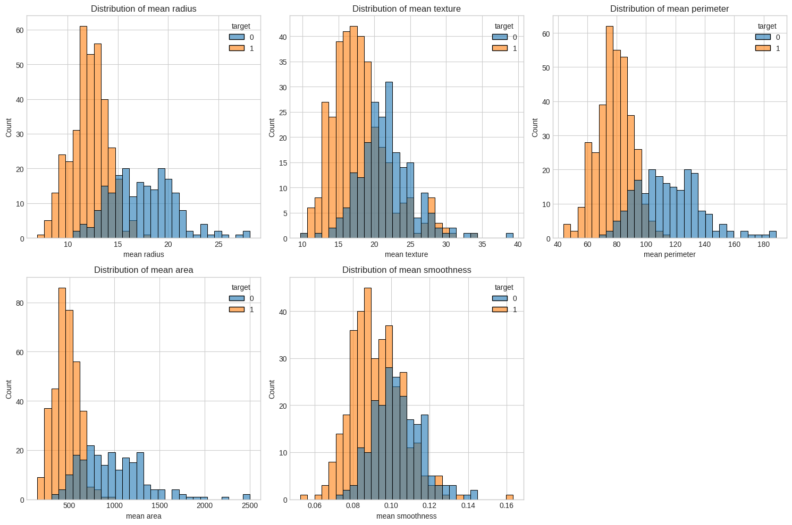
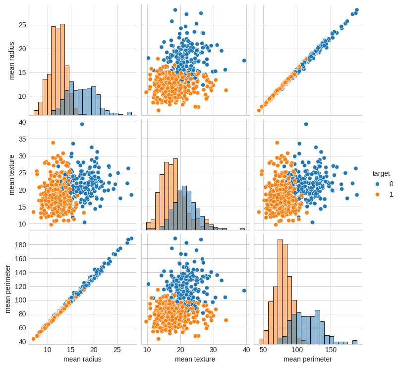
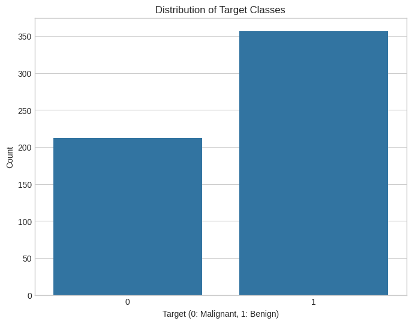

# Breast Cancer Classification using PyTorch

A deep learning model built with PyTorch to classify breast cancer cases using the Wisconsin Breast Cancer dataset. The model achieves 98.25% accuracy on the test set.

## Table of Contents
- [Overview](#overview)
- [Requirements](#requirements)
- [Project Structure](#project-structure)
- [Installation](#installation)
- [Model Architecture](#model-architecture)
- [Training Process](#training-process)
- [Results](#results)

## Overview
This project implements a neural network classifier using PyTorch to predict breast cancer diagnoses. The model is trained on the Wisconsin Breast Cancer dataset and uses a simple feedforward neural network architecture with one hidden layer.

## Requirements
- Python 3.x
- PyTorch
- torchvision
- scikit-learn
- CUDA-capable GPU (optional, but recommended)

## Project Structure
The project consists of the following main components:

1. Data Preprocessing
   - Loading the Wisconsin Breast Cancer dataset
   - Train-test splitting (80-20 split)
   - Feature standardization using StandardScaler
   - Converting data to PyTorch tensors

2. Model Architecture
   - Input layer (30 features)
   - Hidden layer (128 neurons) with ReLU activation
   - Output layer (1 neuron) with Sigmoid activation

3. Training Pipeline
   - Binary Cross-Entropy Loss
   - Adam optimizer
   - GPU acceleration support

## Installation

```bash
pip install torch torchvision scikit-learn
```

## Model Architecture

```python
class NeuralNetwork(nn.Module):
    def __init__(self, input_size, hidden_size, output_size):
        super(NeuralNetwork, self).__init__()
        self.fc1 = nn.Linear(input_size, hidden_size)
        self.relu = nn.ReLU()
        self.fc2 = nn.Linear(hidden_size, output_size)
        self.sigmoid = nn.Sigmoid()

    def forward(self, x):
        out = self.fc1(x)
        out = self.relu(out)
        out = self.fc2(out)
        out = self.sigmoid(out)
        return out
```

### Hyperparameters
- Input size: 30 (number of features)
- Hidden layer size: 128
- Output size: 1 (binary classification)
- Learning rate: 0.001
- Number of epochs: 100

## Training Process

The training process includes:
1. Data preparation:
   - Loading and splitting the dataset
   - Standardizing features
   - Converting to PyTorch tensors

2. Model training:
   - Forward propagation
   - Loss calculation using Binary Cross-Entropy
   - Backpropagation
   - Optimization using Adam
   - Progress monitoring every 10 epochs

3. Model evaluation:
   - Validation on test set
   - Accuracy calculation

## Results

The model achieves excellent performance:
- Training accuracy: 98.46%
- Test accuracy: 98.25%

Training progress (sample epochs):
```
Epoch [10/100], Loss: 0.4617 Accuracy: 90.99%
Epoch [50/100], Loss: 0.1540 Accuracy: 95.60%
Epoch [100/100], Loss: 0.0841 Accuracy: 98.46%
```

The high test accuracy indicates that the model generalizes well to unseen data and is suitable for breast cancer classification tasks.

## Some visualizations for the data

### Mean Smoothness


### Dataset Plot


### Data Count

